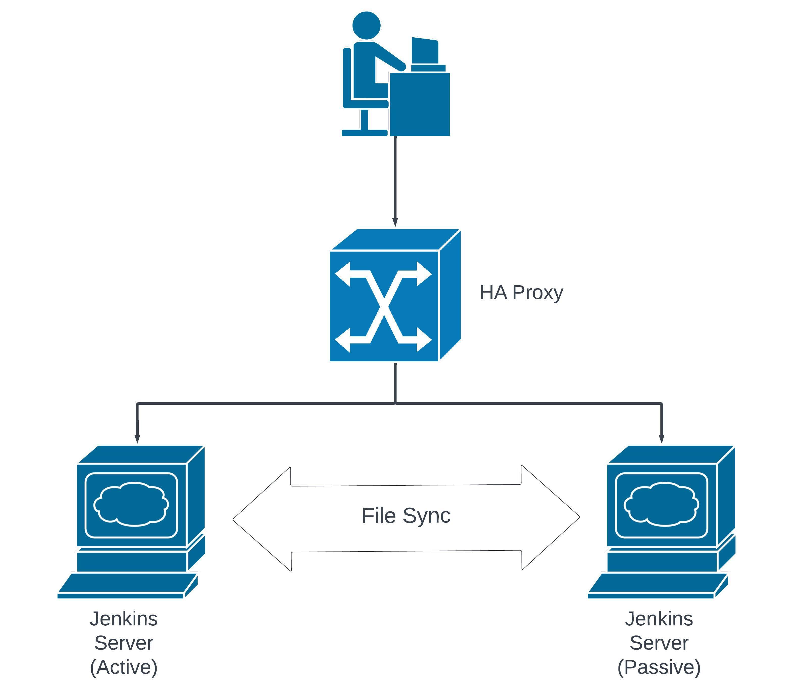

<!-- TOC -->
  * [Jenkins High Availability](#jenkins-high-availability)
  * [Disadvantages of using a single instance of Jenkins](#disadvantages-of-using-a-single-instance-of-jenkins)
  * [Design](#design)
  * [Setting up Guide](#setting-up-guide)
    * [Pre-requisite](#pre-requisite)
      * [Prerequisite knowledge](#prerequisite-knowledge)
      * [Prerequisite setup](#prerequisite-setup)
    * [Install Jenkins on both the servers](#install-jenkins-on-both-the-servers)
    * [Install HA Proxy](#install-ha-proxy)
    * [Configure HAProxy to point to the Jenkins instances](#configure-haproxy-to-point-to-the-jenkins-instances)
    * [Add a corn job to in Jenkins-2 to Reload](#add-a-corn-job-to-in-jenkins-2-to-reload)
    * [Access the HAproxy URL from the browser](#access-the-haproxy-url-from-the-browser)
<!-- TOC -->

## Jenkins High Availability
Jenkins is a leading tool in the DevOps world, renowned for its role in creating robust pipelines. Its popularity is easy to understand:

It’s open source and free to use.
It scales from small personal projects to large enterprise solutions.
Given its critical role in software delivery, it’s essential to ensure Jenkins is always up and running—24/7. So, how do we achieve high availability for Jenkins? In other words, how do we make sure Jenkins remains reliable and accessible at all times?

A standout benefit of our approach to Jenkins high availability is that you won’t need Network Attached Storage (NAS). Instead, we’ll show you how to maintain a reliable Jenkins environment without the extra complexity and cost of a NAS setup.

In this article, we’ll explore strategies to make Jenkins highly available while avoiding the need for NAS, ensuring it supports your software delivery process without interruption.

## Disadvantages of using a single instance of Jenkins
* Relying on a single Jenkins instance creates a single point of failure, which is risky and unacceptable in a production environment.
* If the sole Jenkins server goes down, all tasks dependent on it will be blocked. Until the Jenkins server is back online, these tasks will remain in a queue.
* Depending on just one Jenkins instance means any downtime or issues with that server will halt your tasks. This can lead to unhappy clients and potential loss of future business.

## Design
The obvious solution to ensuring Jenkins high availability is to have at least two instances of Jenkins running. Instead of relying on a single instance, which poses a significant risk, we can set up a second Jenkins server to take over if anything happens to the primary one. By utilizing cron jobs to regularly sync Jenkins data between the two servers, we ensure that job-related data is always up-to-date on both instances. This setup provides a seamless transition between servers, keeping your tasks running smoothly even in the event of a failure.


In our Jenkins High Availability (HA) architecture:

HAProxy: This acts as the front end. We access the Jenkins dashboard via the HAProxy IP, making it the single point of entry.
Jenkins Instances: We have two Jenkins instances configured as the backend, following an Active-Passive model.

Here's how it works:

1. Jenkins 1 (Active): This is the primary instance. As long as Jenkins 1 is operational, HAProxy directs all traffic to this server.
2. Jenkins 2 (Passive): This instance remains on standby. HAProxy will only redirect traffic here if Jenkins 1 goes down.

How the File Sync works:

The Jenkins reload script you've created is designed to manage the synchronization and availability of two Jenkins controllers in a High Availability (HA) setup. Here's a breakdown of how it works:

1. Check Availability of Jenkins 1 (Primary Server): The script begins by checking if Jenkins 1 (the primary controller) is available by making an HTTP request to the Jenkins login page. If Jenkins 1 is up and running, it returns a 2xx or 3xx status code.
If the response is positive, the script logs that Jenkins 1 is available and proceeds with syncing data from Jenkins 1 to Jenkins 2.
2. Forward Sync (Jenkins 1 to Jenkins 2): Assuming Jenkins 1 is available, the script performs a forward sync. This involves syncing the contents of the /var/lib/jenkins directory from Jenkins 1 to Jenkins 2 using rsync. The sync ensures that all job data, configurations, and other necessary files are copied from the primary controller to the secondary one.
3. Handle Jenkins 1 Downtime: If Jenkins 1 is not available, the script checks whether the machine is SSH-accessible. This is important because Jenkins might be down, but the server itself could still be reachable.
If SSH connectivity is confirmed, the script initiates a reverse sync. This operation syncs the data from Jenkins 2 to Jenkins 1, assuming that Jenkins 2 has taken over operations and now contains the most recent and relevant data.
4. Reverse Sync on Jenkins 1 Recovery: Once Jenkins 1 becomes available again, the script performs a one-time reverse sync to ensure that any changes made while Jenkins 1 was down are reflected in Jenkins 1.
After this reverse sync, the script resumes the regular forward sync process, where Jenkins 1 is treated as the primary source of truth.
5. Jenkins Service Management: After syncing, the script also handles the restart of the Jenkins service on both servers to apply any changes made during the sync.
This ensures that the Jenkins service on both servers is running with the latest data and configurations.
6. Cron Job Execution: The entire process is set to run every minute using a cron job. This frequent execution ensures that any changes are quickly propagated across both Jenkins servers, maintaining high availability and minimizing downtime.
This approach ensures that Jenkins remains operational even if one of the controllers goes down, providing a robust HA solution without relying on external network storage like NAS.

## Setting up Guide

### Pre-requisite
To complete this tutorial, you would need below –

#### Prerequisite knowledge
1. Knowledge/ experience on Jenkins
2. Concept of High Availability (HA)
3. Knowledge/ experience on HAProxy

#### Prerequisite setup
Two separate machines for two Jenkins instances. We will be using a Ubuntu 24.04 LTS machine. Another Ubuntu 24.04 LTS machine for HAProxy.
The user should have sudo privileges to install the software packages in all the Linux machines.

### Install Jenkins on both the servers
```shell
# Install java
sudo apt update
sudo apt install -y fontconfig openjdk-17-jre
java -version
 
# Install Jenkins
sudo wget -O /usr/share/keyrings/jenkins-keyring.asc \
  https://pkg.jenkins.io/debian-stable/jenkins.io-2023.key
echo "deb [signed-by=/usr/share/keyrings/jenkins-keyring.asc]" \
  https://pkg.jenkins.io/debian-stable binary/ | sudo tee \
  /etc/apt/sources.list.d/jenkins.list > /dev/null
sudo apt-get update
sudo apt-get install -y jenkins
```
Once both Jenkins instances are up and running, open your browser and verify that the URLs for both Jenkins servers are accessible. You can access Jenkins using the following URL format: `http://<IP_address_of_your_machine>:8080 `

Important: Ensure that port 8080 is open on your network. You may need to add an inbound rule to allow traffic through this port.

Next, follow the on-screen instructions in the Jenkins UI to complete the setup process.

### Install HA Proxy
In this step, we will install HAProxy on a different machine. In our case, we will be using one Ubuntu machine where HAProxy will be installed.
```shell
sudo apt update
sudo apt install -y haproxy
```

### Configure HAProxy to point to the Jenkins instances
To configure HAProxy we need to edit the `/etc/haproxy/haproxy.cfg`  file. Once you open the haproxy.cfg  file, delete or remove all the content from this file. Use the below configurations and edit the IP address of Jenkins 1 and 2

[haproxy.cfg](haproxy.cfg)

Note: Port 80 should be allowed in your machine network. Inbound rule should be added with port 80. Your HAProxy machine should be able to communicate with both Jenkins instance over port 8080. Also, both Jenkins instance should allow inbound communication from the HAProxy machine.

Start and Check status of HAProxy

```shell
systemctl start haproxy && systemctl status haproxy
```

### Add a corn job to in Jenkins-2 to Reload
To sync the job and instance related data between the two Jenkins instances, if we create/edit any job in the dashboard of Jenkins-1, that change or edit would not be automatically reflected in the dashboard of Jenkins-2. To reflect those changes, we need to reload the Jenkins 2. There are a few ways through which we can reload any Jenkins instance –
1. From the browser if we hit this URL: `http://<Jenkins_machine_IP>:8080/reload`, it would be reloaded.
2. From the Jenkins machine CLI, if we run this command, `curl -u user:api_token http://<Jenkins_machine_IP>:8080/reload`, it will be reloaded.
3. From jenkins-cli from the machine if we run this command -> `java -jar ~/jenkins-cli.jar -s http://<IP_of_Jenkins_2>:8080/ -auth admin:admin reload-configuration`
4. From systemctl process → `systemctl restart jenkins.service`

We will follow the fourth approach (point number 4) to reload Jenkins-2, and we need the system configuration also to be reloaded. Jenkins-2 will be restarted only when Jenkins-1 is not online. To avoid the manual reloading of Jenkins-2, we would create one cron job in Jenkins-2 which will run a shell script every 1 min to reload it.

Before doing that we will need to Add the public ssh key to be used in `/root/.ssh/authorized_keys` of Jenkins-1 and store the private key in Jenkins-2 whose path will be needed in the below file

Now we will create a shell script jenkins_reload.sh. In our case, we will create the shell script in /root directory. You may create in any other place also. Execute the below commands. 

[jenkins_reload.sh](jenkins_reload.sh)

To add it to the cron job, execute crontab -e and select the editor of choice example vim and add the below line to it. It will run the scrip every 1 minute. Adjust the frequency as per need. 
```shell
*/1 * * * * /root/jenkins_reload.sh
```

### Access the HAproxy URL from the browser
Finally, we can access our highly available Jenkins instances through the HAProxy IP address or HAProxy URL (if DNS is configured). You need to access the below URL from the browser.
`http://<IP_of_HAproxy>:80 `

Note: Jenkins instances should be up & running. If any one of them is down then also we will be using Jenkins since we have two Jenkins instances.